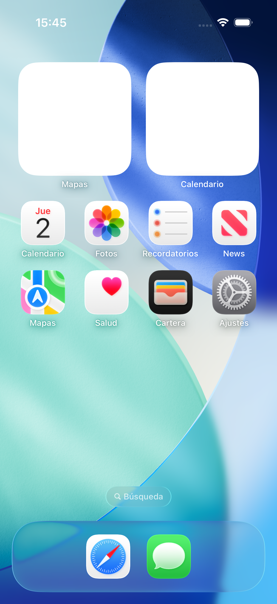

# Etiove

App movil de cafe de especialidad con enfoque premium: catalogo, detalle sensorial, gamificacion, foro, diario de catas, cafeterias cercanas y notificaciones push.

## Que incluye hoy

- Autenticacion con Firebase Auth REST (token guardado en SecureStore)
- Catalogo de cafes (mis cafes, top, ultimos anadidos, favoritos)
- Detalle de cafe con votacion y acciones de favorito
- Foro de comunidad (hilos, respuestas, adjuntos y acciones de autor)
- Gamificacion (XP, niveles, logros y toast de desbloqueo)
- Diario de catas y notas
- Cafeterias cercanas con Google Places API
- Push local con `expo-notifications`
- Push remoto server-driven con Cloud Functions (Gen2)
- Cache offline de colecciones con `expo-file-system`

## Stack tecnico

- Expo SDK 54 + React Native 0.81
- Firestore REST API (sin SDK cliente de Firestore)
- Firebase Auth REST
- Firebase Storage (subida de imagenes)
- Cloud Functions for Firebase (Node.js 22)
- Expo Notifications, Expo Location, Expo Camera, Expo Haptics

## Instalacion

### 1) Clonar e instalar

```bash
git clone https://github.com/zarezfamily/etiove.git
cd etiove
npm install
```

### 2) Configurar variables de entorno

```bash
cp .env.example .env
```

Rellena `.env`:

```env
EXPO_PUBLIC_FIREBASE_API_KEY=...
EXPO_PUBLIC_FIREBASE_PROJECT_ID=...
EXPO_PUBLIC_FIREBASE_STORAGE_BUCKET=... # normalmente <project-id>.appspot.com
EXPO_PUBLIC_GOOGLE_PLACES_KEY=...
```

Notas:

- El proyecto usa API REST de Firebase, por eso `AUTH_DOMAIN`, `APP_ID` y `MESSAGING_SENDER_ID` no son obligatorias en el flujo actual.
- `EXPO_PUBLIC_GOOGLE_PLACES_KEY` es obligatoria para que funcione la pantalla de cafeterias cercanas.

### 3) Google Places (requerido para Cafeterias)

Debes crear una API key en Google Cloud con Places API habilitada.

Pasos recomendados:

1. Crear una clave en Google Cloud Console
2. Habilitar Places API
3. Restringir por API (Places) y por app segun entorno
4. Pegarla en `.env` como `EXPO_PUBLIC_GOOGLE_PLACES_KEY`

Si no esta configurada, la app muestra mensaje de configuracion y no carga cafeterias.

### 4) Ejecutar en desarrollo

```bash
npx expo start
```

## Cloud Functions (push remoto)

El repo incluye funciones en `functions/` para disparar notificaciones push remotas cuando:

- Se crea un cafe nuevo en comunidad
- Se responde un hilo del foro
- Cambia la puntuacion de un cafe favorito

Deploy:

```bash
cd functions
npm install
cd ..
CI=true npx firebase-tools deploy --only functions --project <tu-project-id> --force
```

Runtime actual: Node.js 22.

## Scripts de datos (seed / import / limpieza)

Los scripts cargan `.env` automaticamente (via `node --env-file=.env`).
Tambien ejecutan un chequeo previo de variables antes de correr (`env:check:*`).

Variables esperadas en `.env` para esta seccion:

- `EXPO_PUBLIC_FIREBASE_PROJECT_ID`
- `EXPO_PUBLIC_FIREBASE_API_KEY` (seed full, delete, import)
- `FIREBASE_AUTH_TOKEN` (seed 5/10 e import con escritura)

Ejecucion:

```bash
npm run seed:5
npm run seed:10
npm run seed:full
npm run cafes:delete
```

Import desde Open Food Facts:

```bash
npm run import:es:coffee:dry
npm run import:es:coffee
```

Si falta alguna variable requerida, el pre-check falla con mensaje explicativo antes de ejecutar el script principal.

## Estructura real del proyecto

```text
etiove/
├── App.js
├── firebaseConfig.js
├── app.json
├── functions/
│   ├── index.js
│   └── package.json
├── src/
│   ├── components/
│   │   ├── AppDialogModal.js
│   │   ├── MemberInfoModal.js
│   │   ├── SkeletonLoader.js
│   │   └── ...
│   ├── constants/
│   │   ├── theme.js
│   │   └── ...
│   ├── core/
│   │   ├── notifications.js
│   │   ├── offlineCache.js
│   │   └── ...
│   ├── hooks/
│   │   ├── useCoffeeData.js
│   │   ├── useForumState.js
│   │   └── useGamification.js
│   ├── screens/
│   │   ├── InicioTab.js
│   │   ├── CommunityTab.js
│   │   ├── MasTab.js
│   │   └── ...
│   └── styles/
│       ├── appStyles.js
│       └── sharedStyles.js
├── assets/
└── scripts/
```

## Dependencias clave del cliente

- `expo-notifications`
- `expo-location`
- `expo-haptics`
- `expo-file-system`
- `expo-camera`
- `expo-image-picker`
- `expo-local-authentication`
- `@expo-google-fonts/playfair-display`
- `expo-font`

## Screenshots

Crea una carpeta `assets/screenshots/` y anade imagenes reales de la app para mostrar la calidad visual del producto.

Recomendacion minima de capturas:

- Inicio premium (wordmark + cards)
- Detalle de cafe
- Comunidad / foro
- Perfil + gamificacion
- Cafeterias cercanas

Nombres esperados:

- `assets/screenshots/home.png`
- `assets/screenshots/detail.png`
- `assets/screenshots/community.png`
- `assets/screenshots/profile.png`
- `assets/screenshots/cafeterias.png`

Render en README (se mostraran en cuanto existan los archivos):





Captura guiada rapida en iOS Simulator:

```bash
npm run screenshots:ios
```

El script te va pidiendo navegar por cada pantalla y pulsar Enter para guardar:

- `assets/screenshots/home.png`
- `assets/screenshots/detail.png`
- `assets/screenshots/community.png`
- `assets/screenshots/profile.png`
- `assets/screenshots/cafeterias.png`

## Seguridad

- `.env` no se sube al repo
- No hardcodear API keys ni tokens
- Reglas de Firestore y Storage versionadas en `firestore.rules` y `storage.rules`
